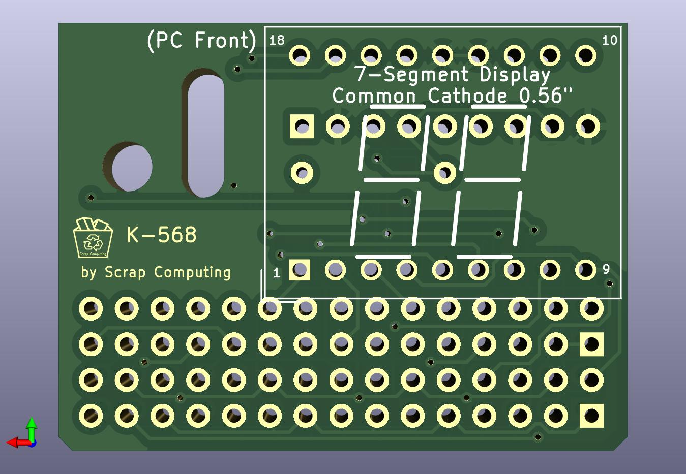
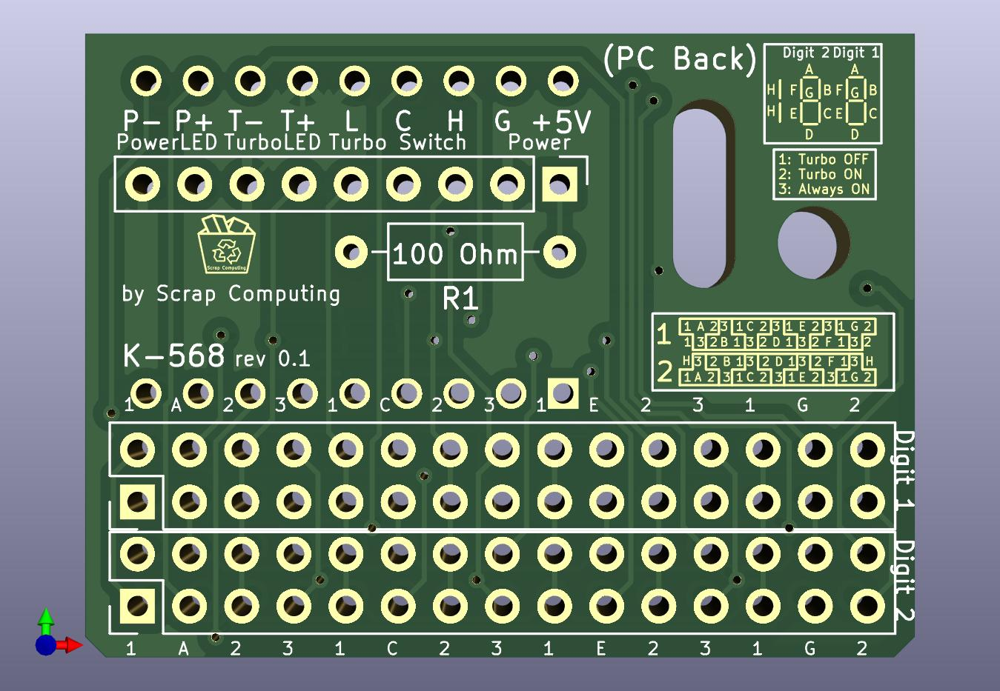
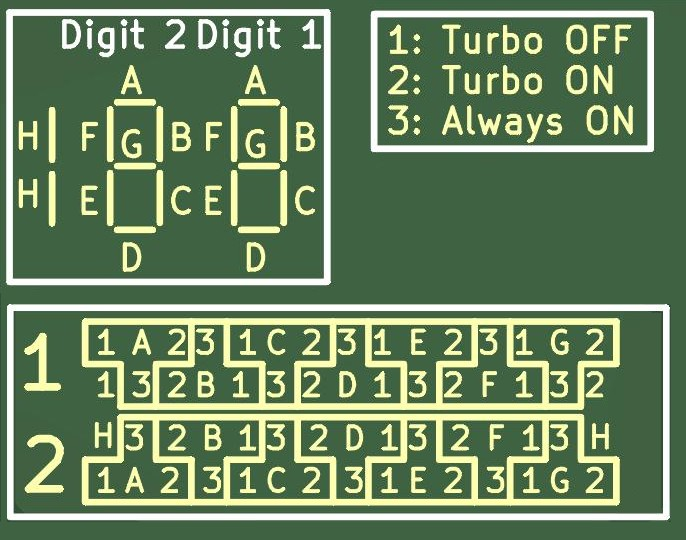

# Reproduction MHz Display K-568

A reproduction of the K-568 MHz display that was common in 386/486 PC cases.
It is powered by 5V DC (pins +5V, G).
It can display a Turbo and a non-Turbo number, depending on the state of the Turbo switch (pins L C H, Low Common High).
It also drives the Turbo LED accordingly (pins T- and T+).
It can also drive the power LED (pins P- and P+).

# How to configure

# Other MHz display reproductions

- [TD-37S](https://github.com/scrapcomputing/MHzDisplayBlaster)

(please let me know of others you may know)

# Resources

- The best resource for MHz displays: [minuszerodegrees.net](https://www.minuszerodegrees.net/led_speed_display/led_speed_display.htm). It includes photos and manuals for a large selection of displays.

# Bill of materials

Gerber files are published in the [releases](https://github.com/scrapcomputing/MHzDisplay_K568/releases).

Reference      | Quantity| Value    | Footprint/Comments
---------------|---------|----------|----------
N/A            | 1       | 18-DIP LED Display | (e.g., LTD-6440G) 18-DIP (0.600", 15.24mm distance between top and bottom row pins) 2-Digit 7-Segment Display Common Cathode 0.56" Green. Should also work with "188" displays, but I can't find a part number (please let me know if you do). Common anode should also work as long as the pinout is the same, but the power needs to be reversed (i.e., +5 to ground and vice versa).
N/A            | 2       | Conn_02x15      | Connector Male PinHeader 2x15 P2.54mm Vertical
N/A            | 1       | Conn_01x09      | Connector Male PinHeader 1x09 P2.54mm Vertical
R1             | 1       | Resistor 100 Ohms 1/4W | 100 Ohms may be quite dimm, depending on the LED technology of the display, so you may try lower values but these should be 1/2W resistors.
N/A            | 15      | Jumpers         | 2.54mm pitch jumpers

# Changelist
- Rev 0.1 : Initial revision
